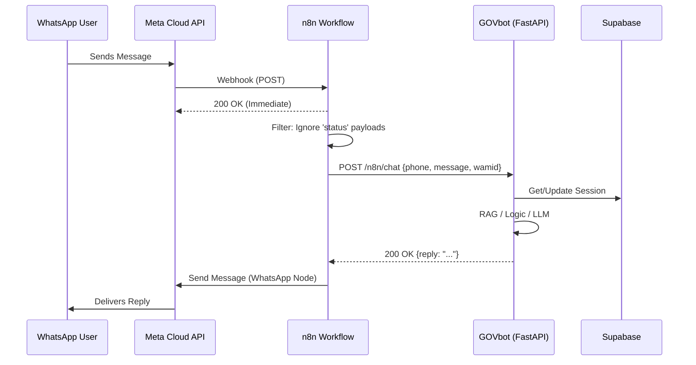

# Phase 1: n8n WhatsApp Integration - Research

**Researched:** 2025-05-14
**Domain:** Workflow Automation & Webhook Orchestration
**Confidence:** HIGH

## Summary

This phase involves transitioning from a direct WhatsApp-to-FastAPI integration to an orchestrated model where **n8n** acts as the primary gateway. n8n will handle the WhatsApp Business Cloud API webhooks, perform initial filtering and security checks, and proxy requests to a new `/n8n/chat` endpoint on the GOVbot server. This architecture increases system resilience, allows for easier debugging of message flows, and provides a no-code interface for future workflow modifications.

**Primary recommendation:** Use n8n's **WhatsApp Trigger** node with **Response Mode: On Received** to immediately acknowledge Meta's webhooks (avoiding retries), and use a simple **API Key Header** to secure the internal `/n8n/chat` endpoint.

## Architectural Responsibility Map

| Capability | Primary Tier | Secondary Tier | Rationale |
|------------|-------------|----------------|-----------|
| Webhook Reception | n8n | — | n8n handles the public Meta-facing endpoint and signature verification. |
| Message Filtering | n8n | — | n8n filters out `status` updates (sent/delivered/read) before calling GOVbot. |
| Session Logic | API / Backend | Database | GOVbot maintains conversation state and business rules in Supabase. |
| RAG / LLM Processing| API / Backend | — | Python handles the heavy lifting of document retrieval and response generation. |
| Response Delivery | n8n | API / Backend | n8n sends the message back to WhatsApp. Backend can still send async alerts if needed. |

## Standard Stack

### Core
| Library | Version | Purpose | Why Standard |
|---------|---------|---------|--------------|
| n8n | latest | Workflow Orchestration | Provides "WhatsApp Trigger" and "WhatsApp Business Cloud" nodes out-of-the-box. |
| FastAPI | 0.109.0 | API Framework | Current project standard; excellent Pydantic integration for payload validation. |
| httpx | 0.27.0 | HTTP Client | Used by GOVbot for any outbound calls; highly reliable async support. |

### Supporting
| Library | Version | Purpose | When to Use |
|---------|---------|---------|--------------|
| Pydantic | 2.x | Data Validation | For defining the `/n8n/chat` request/response schemas. |
| Supabase | 2.x | Database | For checking message idempotency (if volume warrants). |

**Installation:**
```bash
# n8n is typically self-hosted via Docker or used via n8n Cloud.
# No new Python packages required (already in requirements.txt).
```

## Architecture Patterns

### System Architecture Diagram



### Recommended Project Structure
```
gov_agent/
├── n8n_router.py      # New: Handles /n8n/chat and security
├── main.py            # Update: Include n8n_router
└── models.py          # Update: Add N8NChatRequest/Response models
```

### Pattern: Webhook Proxy with Immediate Response
To prevent Meta from retrying webhooks due to LLM latency (which often exceeds the 10s Meta timeout):
1. Set the **WhatsApp Trigger** node to `Response Mode: On Received`.
2. This closes the connection with Meta immediately with a `200 OK`.
3. n8n continues the execution in the background, calls GOVbot, and sends the final response via the WhatsApp Business Cloud node.

## Don't Hand-Roll

| Problem | Don't Build | Use Instead | Why |
|---------|-------------|-------------|-----|
| WhatsApp API Client | Custom httpx calls | n8n WhatsApp Node | Handles complex payload structures and authentication automatically. |
| Webhook Verification | Custom GET verify logic | n8n WhatsApp Trigger | Built-in support for Meta's verification challenge. |
| Retries / Error Handling| Custom try/except | n8n Error Trigger | Allows visual debugging and automatic retries in the workflow. |

## Common Pitfalls

### Pitfall 1: Meta Timeout Retries
**What goes wrong:** Meta retries the webhook if your server takes >10s. This leads to the bot replying 3-4 times to the same message.
**Why it happens:** AI/RAG processing often takes 15-30s.
**How to avoid:** Use n8n's "Immediate Response" mode. n8n accepts the message and closes the Meta connection *before* calling GOVbot.

### Pitfall 2: Status Update Loops
**What goes wrong:** Your workflow triggers for "Message Sent", "Message Delivered", and "Message Read" notifications.
**Why it happens:** Meta sends webhooks for all event types.
**How to avoid:** Use a Filter node in n8n to check if `{{ $json.value.messages }}` exists. If not (i.e., it's a `status` update), stop the workflow.

### Pitfall 3: Fragmented Input
**What goes wrong:** User sends "Hi" then "I want to apply" in two messages. The bot triggers twice and gets confused.
**How to avoid:** Implementation of a "Wait/Debounce" node in n8n (optional for Phase 1 but good to know) to group messages from the same ID within 5 seconds.

## Code Examples

### FastAPI: Secured /n8n/chat Endpoint
```python
# gov_agent/n8n_router.py
from fastapi import APIRouter, Header, HTTPException, Depends
from pydantic import BaseModel
from gov_agent import session_manager
from gov_agent.models import WhatsAppIncoming

router = APIRouter()

class N8NChatRequest(BaseModel):
    phone: str
    message: str
    wamid: str  # WhatsApp Message ID for potential idempotency checks

class N8NChatResponse(BaseModel):
    reply: str

def verify_n8n_key(x_api_key: str = Header(...)):
    # In production, use environment variable
    if x_api_key != "your-secure-n8n-token":
        raise HTTPException(status_code=403, detail="Invalid API Key")

@router.post("/chat", response_model=N8NChatResponse)
async def n8n_chat(payload: N8NChatRequest, _=Depends(verify_n8n_key)):
    # Map n8n payload to internal logic
    msg = WhatsAppIncoming(
        phone=payload.phone,
        message_type="text",
        body=payload.message
    )
    reply = await session_manager.handle_incoming(msg)
    return {"reply": reply}
```

## Assumptions Log

| # | Claim | Section | Risk if Wrong |
|---|-------|---------|---------------|
| A1 | n8n will be the entry point for all WA messages. | Summary | Logic might stay duplicated in old webhook. |
| A2 | Meta timeout is 10s. | Pitfalls | Retries might happen even earlier. |
| A3 | API Key is sufficient security. | Summary | Security requirements might be stricter (OAuth2). |

## Open Questions

1. **Idempotency Management:** Should GOVbot store `wamid` to prevent double-processing even if n8n retries? (Recommendation: Start without it, add if duplicates occur).
2. **Media Handling:** The requirement only specifies `{"message": "string"}`. How should n8n pass image URLs/IDs in the future? (Recommendation: Keep it as text for now).

## Environment Availability

| Dependency | Required By | Available | Version | Fallback |
|------------|------------|-----------|---------|----------|
| FastAPI | Backend API | ✓ | 0.109.0 | — |
| n8n | Orchestration | ✗ | — | Local Docker install |
| Supabase | Session State | ✓ | Cloud | — |

## Security Domain

### Applicable ASVS Categories

| ASVS Category | Applies | Standard Control |
|---------------|---------|-----------------|
| V5 Input Validation | yes | Pydantic validation on `/n8n/chat` |
| V4 Access Control | yes | API Key Header (`X-API-Key`) |

### Known Threat Patterns

| Pattern | STRIDE | Standard Mitigation |
|---------|--------|---------------------|
| Webhook Spoofing | Spoofing | n8n verifies Meta signature; GOVbot verifies n8n API Key. |
| DoS via Retries | Availability | Immediate 200 OK response in n8n. |

## Sources

### Primary (HIGH confidence)
- [n8n Docs - WhatsApp Node](https://docs.n8n.io/integrations/builtin/app-nodes/n8n-nodes-base.whatsapp/)
- [n8n Docs - HTTP Request Security](https://docs.n8n.io/integrations/creating-nodes/build/reference/http-helpers/)
- [FastAPI Security Reference](https://fastapi.tiangolo.com/tutorial/security/)

### Secondary (MEDIUM confidence)
- Community patterns for n8n + AI Agent orchestration (from various technical blogs and Reddit).

## Metadata
**Research date:** 2025-05-14
**Valid until:** 2025-06-14
