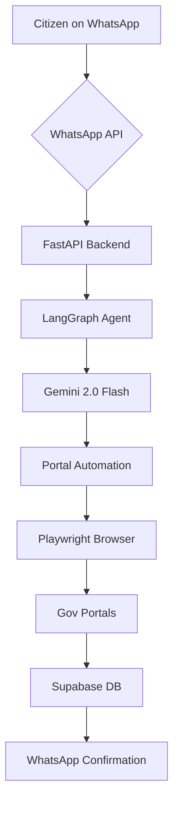
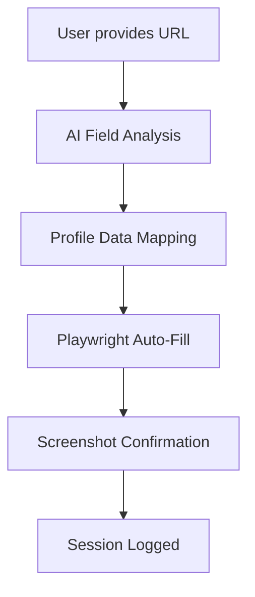

# GovBot 🤖🇮🇳

WhatsApp-first agentic AI for Indian government service delivery. Seamlessly bridging the gap between citizens and government portals through a conversational interface.

[](https://fastapi.tiangolo.com/)
[](https://nextjs.org/)
[](https://langchain-ai.github.io/langgraph/)
[](https://deepmind.google/technologies/gemini/)
[](https://supabase.com/)
[](https://playwright.dev/)
[](https://tailwindcss.com/)
[](https://vercel.com/)

---

### 🌐 [Live Demo](https://govbot-fawn.vercel.app)


## ⚠️ The Problem

- **Portal Fatigue:** Navigating multiple, often complex government portals is overwhelming for the average citizen.
- **Language & Tech Barriers:** Non-tech savvy users struggle with digital-first application processes.
- **Manual Overhead:** Time-consuming form-filling and repetitive data entry lead to errors and delays.
- **Fragmented Tracking:** No single place to track all government applications on a mobile device.

## ⚙️ How it works


`WhatsApp -> FastAPI -> LangGraph -> Gemini -> Playwright -> Gov Portals -> Supabase -> WhatsApp`

## 💬 Conversation Flow

| Step | Action | Description |
| :--- | :--- | :--- |
| 1 | **Initiation** | User sends "Hi" or a service request to the WhatsApp bot. |
| 2 | **Profile Management** | Bot manages user profile with "profile" or "my profile" commands. |
| 3 | **Universal Form Fill** | User says "fill form" or "autofill" to start universal form auto-fill. |
| 4 | **Form URL Input** | User provides any government form URL for analysis. |
| 5 | **Field Mapping** | AI analyzes form structure and maps fields to user profile data. |
| 6 | **Auto-Fill Execution** | Playwright automatically fills the form with user's data. |
| 7 | **Completion** | Screenshot confirmation sent back to user on WhatsApp. |

### 🔄 Form Auto-Fill Workflow



### 📱 WhatsApp Commands

| Command | Description |
| :--- | :--- |
| `hi` / `hello` | Start a conversation |
| `profile` / `my profile` | View and manage your profile |
| `fill form` / `autofill` | Start universal form auto-fill |
| `update profile` | Update your profile information |
| `set pin` / `set passkey` | Set a 4-digit security PIN for sensitive data |
| `my pan` / `my aadhaar` | View documents (passkey required) |
| `web` | Get a link to log in to the web dashboard |
| Any scheme name (e.g., "PM-KISAN") | Start a scheme application |

## 🛠 Tech Stack

| Component | Technology |
| :--- | :--- |
| **Backend** | FastAPI (Python) |
| **Agentic Framework** | LangGraph |
| **LLM** | Google Gemini 2.0 Flash |
| **RAG** | ChromaDB + Gemini Embeddings |
| **Automation** | Playwright |
| **Messaging** | Meta WhatsApp Cloud API + Twilio SMS Fallback |
| **Database** | Supabase (Postgres) |
| **Authentication** | OTP via WhatsApp + JWT + QR Code Login + DigiLocker OAuth |
| **OCR** | Aadhaar card extraction via Gemini Vision |
| **Smart Contracts** | Solidity (credential anchoring) |
| **Frontend** | Next.js 15 (TypeScript + Tailwind CSS) |
| **Deployment** | Vercel (Frontend) + ngrok / Railway (Backend) |

## 🚀 Features

### Core
1.  **WhatsApp-First** — No new app to download; just message and apply.
2.  **Universal Form Auto-Fill** — Fill ANY government form automatically with just a URL.
3.  **Citizen Profile** — Build your profile once with OCR quick-fill, DigiLocker sync, or manual entry. Controlled inputs with per-section Save button.
4.  **Intelligent Chatbot** — Powered by Google Gemini 2.0 Flash for natural conversations.
5.  **Eligibility Screener** — Auto-checks scheme eligibility before collecting any data.

### Document & Identity
6.  **Smart OCR** — Extracts data from Aadhaar card photos using Gemini Vision.
7.  **DigiLocker Integration** — OAuth-based document fetch and real-time validity checks.
8.  **4-Digit Passkey** — Security gate for viewing sensitive data (PAN, Aadhaar) via WhatsApp.

### Portals & Automation
9.  **Multi-Portal Support** — PM-KISAN, PM Scholarship (PMSS), Central Scholarship (CSSS), Minority schemes.
10. **Playwright Automation** — Agents fill out government forms in real-time via headless browser.
11. **AI Form Scanner** — Detects form fields and maps them to profile data for any portal URL.

### Tracking & Finance
12. **Live Tracking** — Real-time application status with timeline breakdown (SSE).
13. **NPCI Bank Verification** — Verify bank accounts before disbursement.
14. **Renewal Automation** — Cron-based renewal reminders and re-application bot.
15. **Credential Wallet** — On-chain credential anchoring via Solidity smart contract.

### Platform
16. **QR Code Login** — Scan a QR on WhatsApp to instantly log in to the web dashboard.
17. **RAG-Powered Responses** — Context-aware answers from official government documentation.
18. **OTP Auth** — One-time passwords delivered directly via WhatsApp, with Twilio SMS fallback.
19. **Analytics Dashboard** — Admin insights on applications, schemes, and user activity.
20. **Gov Officer Dashboard** — Disbursement tracking, fraud detection, and regional views.

## 🛠 Setup Instructions

1.  **Clone the Repository**
    ```bash
    git clone https://github.com/shashank03-dev/GovBot.git
    cd GovBot
    ```

2.  **Install Backend Dependencies**
    ```bash
    pip install -r requirements.txt
    ```

3.  **Setup Playwright**
    ```bash
    playwright install chromium
    ```

4.  **Configure Environment Variables**
    Create a `.env` in the root and `frontend/.env.local` for the frontend (see below).

5.  **Run the Backend**
    ```bash
    uvicorn gov_agent.main:app --host 0.0.0.0 --port 8000 --reload
    ```

6.  **Expose Backend via ngrok (for Vercel + WhatsApp)**
    ```bash
    ngrok http 8000
    ```

7.  **Run the Frontend**
    ```bash
    cd frontend
    npm install
    npm run dev
    ```

## 🔑 Environment Variables

### Backend (`.env`)
| Variable | Description |
| :--- | :--- |
| `WHATSAPP_TOKEN` | Meta WhatsApp Cloud API Access Token |
| `WHATSAPP_PHONE_NUMBER_ID` | Your WhatsApp Phone ID |
| `WHATSAPP_VERIFY_TOKEN` | Token for Webhook Verification |
| `SUPABASE_URL` | Your Supabase Project URL |
| `SUPABASE_KEY` | Supabase Service Role Key |
| `GEMINI_API_KEY` | Google AI Studio Gemini API Key |
| `SECRET_KEY` | JWT Secret Key for Auth |
| `FRONTEND_URL` | Frontend URL for QR login redirects (e.g. `https://govbot-fawn.vercel.app`) |
| `DIGILOCKER_CLIENT_ID` | DigiLocker OAuth App Client ID |
| `DIGILOCKER_CLIENT_SECRET` | DigiLocker OAuth App Client Secret |
| `DIGILOCKER_REDIRECT_URI` | DigiLocker OAuth Callback URL |
| `TWILIO_ACCOUNT_SID` | Twilio Account SID (SMS fallback) |
| `TWILIO_AUTH_TOKEN` | Twilio Auth Token |
| `TWILIO_FROM_NUMBER` | Twilio sender phone number |

### Frontend (`frontend/.env.local`)
| Variable | Description |
| :--- | :--- |
| `NEXT_PUBLIC_API_URL` | Backend URL (ngrok URL or Railway URL) |
| `NEXT_PUBLIC_FRONTEND_URL` | Frontend URL (your Vercel deployment URL) |
| `NEXT_PUBLIC_SUPABASE_URL` | Supabase Project URL |
| `NEXT_PUBLIC_SUPABASE_ANON_KEY` | Supabase Anonymous Key |

## 📂 Project Structure

```text
GovBot/
├── gov_agent/                        # Backend
│   ├── main.py                       # FastAPI entry point + router registration
│   ├── config.py                     # Environment variable configuration
│   ├── db.py                         # Supabase client
│   ├── models.py                     # Pydantic schemas
│   │
│   ├── whatsapp_webhook.py           # Meta webhook handler
│   ├── whatsapp_sender.py            # WhatsApp message sender
│   ├── sms_sender.py                 # Twilio SMS fallback
│   │
│   ├── auth_router.py                # OTP & JWT login routes
│   ├── qr_login.py                   # QR code login for web dashboard
│   ├── session_manager.py            # Conversation state management
│   ├── flow_router.py                # LangGraph conversation flow + passkey
│   ├── graph.py                      # Agent graph definition
│   │
│   ├── profile_router.py             # Citizen profile CRUD + OCR fill
│   ├── eligibility_router.py         # Scheme eligibility screener
│   ├── form_scanner_router.py        # Universal form scanner & auto-fill
│   ├── ocr_router.py                 # Aadhaar OCR extraction
│   │
│   ├── portal_router.py              # Multi-portal router
│   ├── portal_agent.py               # Playwright automation base
│   ├── pm_kisan_agent.py             # PM-KISAN portal agent
│   ├── pm_kisan_router.py            # PM-KISAN routes
│   ├── pmss_agent.py                 # PM Scholarship agent
│   ├── csss_agent.py                 # Central Scholarship agent
│   ├── minority_agent.py             # Minority Welfare agent
│   │
│   ├── digilocker_router.py          # DigiLocker OAuth + document fetch
│   ├── digilocker_agent.py           # DigiLocker document agent
│   ├── doc_validator_router.py       # Document validity checker
│   │
│   ├── npci_router.py                # NPCI bank verification routes
│   ├── npci_agent.py                 # NPCI bank verification agent
│   ├── credentials_router.py         # Credential wallet routes
│   ├── credentials_agent.py          # On-chain credential agent
│   │
│   ├── track_router.py               # Application tracking
│   ├── live_router.py                # Real-time status (SSE)
│   ├── analytics_router.py           # Admin analytics
│   ├── renewal_router.py             # Renewal management
│   ├── renewal_cron.py               # Scheduled renewal reminders
│   ├── rag_engine.py                 # ChromaDB RAG integration
│   └── docs/                         # Documentation & media
│
├── frontend/                         # Next.js 15 Application
│   ├── components/
│   │   ├── Layout.tsx                # Global layout with navbar
│   │   ├── ProfilePrefillBanner.tsx  # Profile auto-fill indicator
│   │   ├── CredentialCard.tsx        # Verifiable credential display
│   │   ├── StatusBadge.tsx           # Application status badges
│   │   ├── AnimatedCounter.tsx       # Animated number counters
│   │   ├── GovBotLoader.tsx          # Loading spinner
│   │   ├── GradientBackground.tsx    # Decorative backgrounds
│   │   ├── PageTransition.tsx        # Page transition animations
│   │   ├── LanguageSelector.tsx      # Language picker
│   │   ├── DemoBanner.tsx            # Demo mode banner
│   │   └── ErrorBoundary.tsx         # Error boundary wrapper
│   ├── pages/
│   │   ├── index.tsx                 # Landing page
│   │   ├── login.tsx                 # OTP login
│   │   ├── dashboard.tsx             # User dashboard
│   │   ├── profile.tsx               # Citizen profile management
│   │   ├── services.tsx              # Services directory
│   │   ├── eligibility.tsx           # Eligibility screener
│   │   ├── form-fill.tsx             # Universal form auto-fill
│   │   ├── ocr.tsx                   # Aadhaar OCR upload
│   │   ├── documents.tsx             # Document manager
│   │   ├── bank-verify.tsx           # Bank account verification
│   │   ├── renewals.tsx              # Renewal manager
│   │   ├── track-search.tsx          # Application search
│   │   ├── track/[id].tsx            # Application status tracker
│   │   ├── admin.tsx                 # Admin analytics view
│   │   ├── pmkisan.tsx               # PM-KISAN portal
│   │   ├── nsp/                      # NSP portal pages
│   │   ├── pmss/                     # PM Scholarship pages
│   │   ├── csss/                     # Central Scholarship pages
│   │   ├── minority/                 # Minority Welfare pages
│   │   ├── digilocker/               # DigiLocker OAuth flow
│   │   ├── wallet/                   # Credential wallet
│   │   ├── verify/                   # Credential verification
│   │   ├── gov-dashboard/            # Gov officer dashboard
│   │   │   ├── index.tsx             # Overview
│   │   │   ├── disbursements.tsx     # Disbursement tracking
│   │   │   ├── fraud.tsx             # Fraud detection
│   │   │   └── regional.tsx          # Regional analytics
│   │   └── api/                      # Next.js API relay routes
│   └── styles/                       # Global CSS + Tailwind config
│
├── api/
│   └── app.py                        # FastAPI instance (imported by main.py)
├── contracts/
│   └── GovBotCredentials.sol         # Solidity credential contract
├── schema.sql                        # Full Supabase DB schema (17 tables)
├── requirements.txt                  # Python dependencies
├── Dockerfile                        # Container build
└── README.md
```

## 🤝 Contributing

Contributions are welcome! Please open an issue or submit a pull request for any improvements or bug fixes.

## 📄 License

This project is licensed under the MIT License - see the LICENSE file for details.
Copyright (c) 2026 **Shashank Gowda**.

---

**Built with ❤️ for Bharat by [Shashank Gowda](https://github.com/shashank03-dev)**
