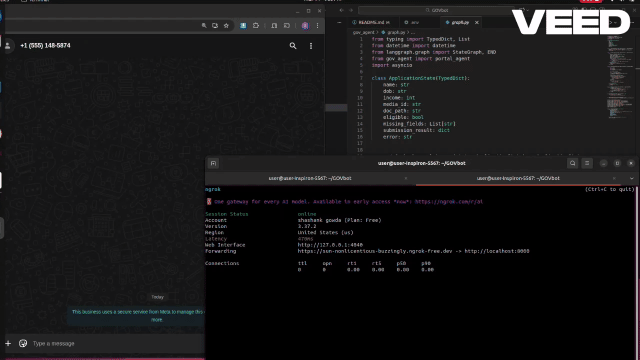

<div align="center">

# 🇮🇳 GovBot

### WhatsApp-first agentic AI that delivers Indian government services — right in your chat.

[](https://python.org)
[](https://fastapi.tiangolo.com)
[](https://github.com/langchain-ai/langgraph)
[](https://nextjs.org)
[](https://supabase.com)
[](https://ai.google.dev)
[](https://developers.facebook.com/docs/whatsapp)
[](LICENSE)

</div>

---

## 🎬 Demo

<div align="center">
  
</div>
- Edited From  **Veed.io**
---

## 🚨 The Problem

India has **1500+ central government schemes** and hundreds more at the state level. Yet:

- 🧭 Most citizens **don't know which schemes they qualify for**
- 📋 Government portals are **complex, English-first, and desktop-only**
- 🕐 Visiting a CSC (Common Service Centre) means **half-day lost from work**
- 📄 Forms are filled **incorrectly**, leading to rejections and re-submissions

**Result:** Billions of rupees in scheme benefits go unclaimed every year.

---

## 💡 How GovBot Works

GovBot meets citizens where they already are — **WhatsApp** — and guides them through the entire service-delivery lifecycle in their language, with zero app downloads or complex logins.

```
Citizen sends a WhatsApp message
          │
          ▼
 ┌─────────────────────┐
 │  WhatsApp Webhook   │  ← FastAPI receives & routes message
 └────────┬────────────┘
          │
          ▼
 ┌─────────────────────┐
 │   Session Manager   │  ← Maintains per-user conversation state
 └────────┬────────────┘
          │
          ▼
 ┌─────────────────────┐
 │    Flow Router      │  ← Determines current step in the journey
 └────────┬────────────┘
          │
    ┌─────┴──────┐
    │            │
    ▼            ▼
┌───────┐  ┌──────────────┐
│  RAG  │  │ Portal Agent │
│Engine │  │ (Playwright) │
└───────┘  └──────────────┘
    │            │
    └─────┬──────┘
          │
          ▼
 ┌─────────────────────┐
 │   LangGraph Agent   │  ← Reasoning, intent detection, form-fill
 └────────┬────────────┘
          │
          ▼
 ┌─────────────────────┐
 │   WhatsApp Sender   │  ← Delivers reply back to citizen
 └─────────────────────┘
          │
          ▼
   Supabase (Postgres)
   Application stored
   Admin dashboard live
```

### Conversation Flow

| Step            | What Happens                                                                       |
| --------------- | ---------------------------------------------------------------------------------- |
| 1️⃣ **Greet**    | User says "Hi". Bot identifies itself and asks what they need.                     |
| 2️⃣ **Discover** | RAG engine searches scheme eligibility based on user profile.                      |
| 3️⃣ **Collect**  | Bot asks for required details — name, Aadhaar, income, etc. — one field at a time. |
| 4️⃣ **Fill**     | Portal Agent (Playwright) auto-fills the government web form.                      |
| 5️⃣ **Verify**   | Bot sends a summary; user confirms or corrects.                                    |
| 6️⃣ **Submit**   | Form is submitted. Application ID is returned to the user.                         |
| 7️⃣ **Track**    | User can WhatsApp "status `<ID>`" anytime to check progress.                       |

---

## 🛠️ Tech Stack

| Layer                  | Technology                    | Purpose                             |
| ---------------------- | ----------------------------- | ----------------------------------- |
| **Messaging**          | WhatsApp Cloud API            | Citizen-facing interface            |
| **Backend**            | FastAPI                       | Webhook server & REST API           |
| **Agent Brain**        | LangGraph + Google Gemini     | Multi-step agentic reasoning        |
| **RAG Pipeline**       | LangChain + Gemini Embeddings | Scheme discovery & Q&A              |
| **Browser Automation** | Playwright                    | Auto-fills government portals       |
| **Database**           | Supabase (Postgres)           | Application records & session state |
| **Admin Dashboard**    | Next.js 15 + TypeScript       | Real-time monitoring & tracking     |

---

## ✨ Features

- 🤖 **Fully Agentic** — LangGraph powers multi-turn, stateful conversations with dynamic branching
- 📚 **RAG-Powered Scheme Discovery** — Retrieval-augmented generation over govt. scheme documents
- 🖥️ **Automated Form Filling** — Playwright navigates and fills live government portals
- 💬 **WhatsApp-Native UX** — No app download, no login. Works on any phone with WhatsApp
- 🧠 **Contextual Session Memory** — Per-user state stored in Supabase across sessions
- 📊 **Admin Dashboard** — Next.js frontend for real-time stats and application tracking
- 🔁 **Application Status Tracking** — Users can track submissions via WhatsApp anytime
- 🔒 **Secure Config** — All secrets via environment variables, no hardcoded credentials
- 📦 **Modular Architecture** — Clean separation between agent, portal, RAG, and webhook layers

---

## 🚀 Setup Instructions

### Prerequisites

- Python 3.11+
- Node.js 18+
- A [Meta Developer App](https://developers.facebook.com/) with WhatsApp Cloud API enabled
- A [Supabase](https://supabase.com) project
- A [Google AI Studio](https://aistudio.google.com) API key (Gemini)
- [ngrok](https://ngrok.com) (for local webhook testing)
- Playwright browsers: `playwright install chromium`

---

### 1. Clone the repo

```bash
git clone https://github.com/shashank03-dev/GOVbot.git
cd GOVbot
```

### 2. Set up the Python backend

```bash
python -m venv .venv
source .venv/bin/activate
pip install -r requirements.txt
playwright install chromium
```

### 3. Configure environment variables

```bash
cp .env.example .env
# Edit .env with your credentials (see section below)
```

### 4. Start the FastAPI server

```bash
uvicorn gov_agent.main:app --reload --port 8000
```

### 5. Expose your local server with ngrok

```bash
ngrok http 8000
# Copy the HTTPS forwarding URL
```

Set your WhatsApp webhook URL in the Meta Developer Console to:

```
https://<your-ngrok-url>/webhook/whatsapp
```

### 6. Start the Admin Dashboard

```bash
cd frontend
npm install
npm run dev
# Open http://localhost:3000
```

---

## 🔐 Environment Variables

Create a `.env` file in the project root with the following variables:

| Variable                   | Description                                             |
| -------------------------- | ------------------------------------------------------- |
| `WHATSAPP_TOKEN`           | Bearer token from Meta WhatsApp Cloud API               |
| `WHATSAPP_PHONE_NUMBER_ID` | Phone Number ID from Meta Developer Console             |
| `WHATSAPP_VERIFY_TOKEN`    | Custom string you set as the webhook verification token |
| `SUPABASE_URL`             | Your Supabase project API URL                           |
| `SUPABASE_KEY`             | Your Supabase project `anon` or `service_role` key      |
| `GEMINI_API_KEY`           | Google AI Studio API key for Gemini                     |

> ⚠️ **Never commit `.env` to version control.** It is already added to `.gitignore`.

For the frontend, create `frontend/.env.local`:

| Variable                        | Description                |
| ------------------------------- | -------------------------- |
| `NEXT_PUBLIC_SUPABASE_URL`      | Same Supabase project URL  |
| `NEXT_PUBLIC_SUPABASE_ANON_KEY` | Supabase `anon` public key |

---

## 📁 Project Structure

```
GOVbot/
├── gov_agent/                  # Core Python backend
│   ├── main.py                 # FastAPI app entrypoint
│   ├── whatsapp_webhook.py     # Webhook route handlers (GET verify + POST receive)
│   ├── whatsapp_sender.py      # Sends messages via WhatsApp Cloud API
│   ├── session_manager.py      # Per-user conversation state management
│   ├── flow_router.py          # Routes messages to the correct agent step
│   ├── graph.py                # LangGraph agent graph definition
│   ├── portal_agent.py         # Playwright browser automation for form filling
│   ├── rag_engine.py           # RAG pipeline for scheme discovery
│   ├── models.py               # Pydantic / SQLAlchemy data models
│   ├── db.py                   # Supabase database client
│   ├── config.py               # Environment variable loader
│   └── docs/                   # Scheme documents for RAG ingestion
│
├── frontend/                   # Next.js admin dashboard
│   ├── pages/
│   │   ├── index.tsx           # Dashboard — stats + applications table
│   │   └── track/[id].tsx      # Application status tracking page
│   ├── styles/                 # Global CSS
│   └── public/                 # Static assets
│
│
├── .env                        # Local secrets (not committed)
├── requirements.txt            # Python dependencies
└── README.md
```

---

## 🤝 Contributing

Pull requests are welcome! For major changes, please open an issue first to discuss what you'd like to change.

1. Fork the repo
2. Create a feature branch: `git checkout -b feature/amazing-feature`
3. Commit your changes: `git commit -m 'feat: add amazing feature'`
4. Push to the branch: `git push origin feature/amazing-feature`
5. Open a Pull Request

---

## 📜 License

Distributed under the MIT License. See [`LICENSE`](LICENSE) for more information.

---

<div align="center">

Built with ❤️ for Bharat by **[Shashank Gowda](https://github.com/shashank03-dev)**

_Making government services accessible to every Indian, one WhatsApp message at a time._

⭐ Star this repo if you find it useful!

</div>
