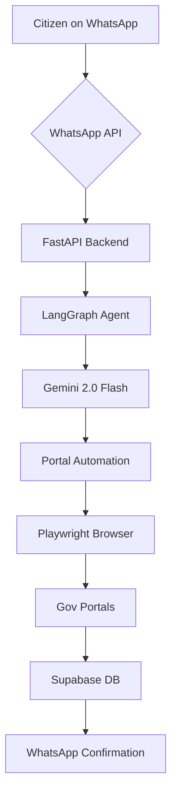

# GovBot 🤖🇮🇳

WhatsApp-first agentic AI for Indian government service delivery. Seamlessly bridging the gap between citizens and government portals through a conversational interface.

[](https://fastapi.tiangolo.com/)
[](https://nextjs.org/)
[](https://langchain-ai.github.io/langgraph/)
[](https://deepmind.google/technologies/gemini/)
[](https://supabase.com/)
[](https://playwright.dev/)
[](https://tailwindcss.com/)
[](https://railway.app/)
[](https://vercel.com/)

---

### 🌐 [Live Demo](https://govbot-fawn.vercel.app) | 📦 [Backend on Railway](https://railway.app)


## ⚠️ The Problem

- **Portal Fatigue:** Navigating multiple, often complex government portals is overwhelming for the average citizen.
- **Language & Tech Barriers:** Non-tech savvy users struggle with digital-first application processes.
- **Manual Overhead:** Time-consuming form-filling and repetitive data entry lead to errors and delays.
- **Fragmented Tracking:** No single place to track all government applications on a mobile device.

## ⚙️ How it works


*(ASCII representation of the flow)*
`WhatsApp -> FastAPI -> LangGraph -> Gemini -> Playwright -> Gov Portals -> Supabase -> WhatsApp`

## 💬 Conversation Flow

| Step | Action | Description |
| :--- | :--- | :--- |
| 1 | **Initiation** | User sends "Hi" or a service request to the WhatsApp bot. |
| 2 | **User Info** | Bot collects basic details like **Name**. |
| 3 | **DOB** | Bot captures the user's **Date of Birth**. |
| 4 | **Income** | Bot asks for **Annual Income** to determine eligibility. |
| 5 | **Identity** | User uploads a photo of their **Aadhaar Card**. |
| 6 | **Processing** | LangGraph orchestrates the flow; Playwright auto-fills the portal form. |
| 7 | **Completion** | A **Confirmation Number** is sent back to the user on WhatsApp. |

## 🛠 Tech Stack

| Component | Technology |
| :--- | :--- |
| **Backend** | FastAPI (Python) |
| **Agentic Framework** | LangGraph |
| **LLM** | Google Gemini 2.0 Flash |
| **RAG** | ChromaDB + Gemini Embeddings |
| **Automation** | Playwright |
| **Messaging** | Meta WhatsApp Cloud API |
| **Database** | Supabase (Postgres) |
| **Authentication** | OTP via WhatsApp + JWT |
| **Frontend** | Next.js 15 (TypeScript + Tailwind) |
| **Deployment** | Railway (Backend), Vercel (Frontend) |

## 🚀 Features

1.  **WhatsApp-First:** No new app to download; just message and apply.
2.  **Intelligent Chatbot:** Powered by Google Gemini 2.0 Flash for natural conversations.
3.  **Smart OCR:** Automatically extracts data from Aadhaar card photos.
4.  **Auto Portals:** Playwright-driven agents fill out government forms in real-time.
5.  **RAG-Powered:** Context-aware responses based on official government documentation.
6.  **Secure Auth:** One-time passwords (OTP) delivered directly via WhatsApp.
7.  **User Dashboard:** View and manage all your applications at a glance.
8.  **Admin Control:** Dedicated `/admin` route for overall application management.
9.  **High Performance:** Built with the latest Next.js 15 and FastAPI for speed.

## 🛠 Setup Instructions

1.  **Clone the Repository**
    ```bash
    git clone https://github.com/shashank03-dev/GovBot.git
    cd GovBot
    ```

2.  **Install Backend Dependencies**
    ```bash
    pip install -r requirements.txt
    ```

3.  **Setup Playwright**
    ```bash
    playwright install chromium
    ```

4.  **Configure Environment Variables**
    Create a `.env` in the root and `frontend/.env.local` for the frontend (see below).

5.  **Run the Backend**
    ```bash
    python3 -m gov_agent.main
    ```

6.  **Run the Frontend**
    ```bash
    cd frontend
    npm install
    npm run dev
    ```

## 🔑 Environment Variables

### Backend (`.env`)
| Variable | Description |
| :--- | :--- |
| `WHATSAPP_TOKEN` | Meta WhatsApp Cloud API Access Token |
| `WHATSAPP_PHONE_NUMBER_ID` | Your WhatsApp Phone ID |
| `WHATSAPP_VERIFY_TOKEN` | Token for Webhook Verification |
| `SUPABASE_URL` | Your Supabase Project URL |
| `SUPABASE_KEY` | Supabase Service Role Key |
| `GEMINI_API_KEY` | Google AI Studio Gemini API Key |
| `SECRET_KEY` | JWT Secret Key for Auth |

### Frontend (`frontend/.env.local`)
| Variable | Description |
| :--- | :--- |
| `NEXT_PUBLIC_SUPABASE_URL` | Supabase Project URL |
| `NEXT_PUBLIC_SUPABASE_ANON_KEY` | Supabase Anonymous Key |
| `NEXT_PUBLIC_RAILWAY_URL` | URL of your deployed backend |

## 📂 Project Structure

```text
GovBot/
├── gov_agent/                # Backend Logic
│   ├── main.py               # FastAPI Entry Point
│   ├── whatsapp_webhook.py    # Meta Webhook Handler
│   ├── whatsapp_sender.py     # Message Sender Service
│   ├── session_manager.py     # Conversation State
│   ├── flow_router.py         # LangGraph Flow Logic
│   ├── graph.py               # Agent Graph Definition
│   ├── portal_agent.py        # Playwright Automation
│   ├── rag_engine.py          # ChromaDB Integration
│   ├── auth_router.py         # OTP & Login Routes
│   ├── models.py              # Pydantic Schemas
│   ├── db.py                  # Supabase Client
│   ├── config.py              # Env Configurations
│   └── docs/                  # Documentation & Media
├── frontend/                 # Next.js Application
│   ├── pages/
│   │   ├── index.tsx         # Login Page
│   │   ├── dashboard.tsx     # User Dashboard
│   │   ├── admin.tsx         # Admin View
│   │   └── track/[id].tsx    # Status Tracker
│   └── pages/api/            # Relay API Routes
├── requirements.txt          # Python Deps
├── Procfile                  # Railway Deployment
└── README.md                 # Project Documentation
```

## 🤝 Contributing

Contributions are welcome! Please open an issue or submit a pull request for any improvements or bug fixes.

## 📄 License

This project is licensed under the MIT License - see the LICENSE file for details.
Copyright (c) 2026 **Shashank Gowda**.

---

**Built with ❤️ for Bharat by [Shashank Gowda](https://github.com/shashank03-dev)**
