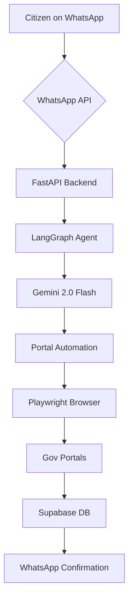
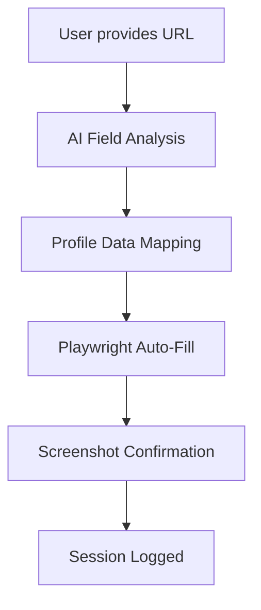

# GovBot 🤖🇮🇳

WhatsApp-first agentic AI for Indian government service delivery. Seamlessly bridging the gap between citizens and government portals through a conversational interface.

[](https://fastapi.tiangolo.com/)
[](https://nextjs.org/)
[](https://langchain-ai.github.io/langgraph/)
[](https://deepmind.google/technologies/gemini/)
[](https://supabase.com/)
[](https://playwright.dev/)
[](https://tailwindcss.com/)
[](https://railway.app/)
[](https://vercel.com/)

---

### 🌐 [Live Demo](https://govbot-fawn.vercel.app) | 📦 [Backend on Railway](https://railway.app)


## ⚠️ The Problem

- **Portal Fatigue:** Navigating multiple, often complex government portals is overwhelming for the average citizen.
- **Language & Tech Barriers:** Non-tech savvy users struggle with digital-first application processes.
- **Manual Overhead:** Time-consuming form-filling and repetitive data entry lead to errors and delays.
- **Fragmented Tracking:** No single place to track all government applications on a mobile device.

## ⚙️ How it works


*(ASCII representation of the flow)*
`WhatsApp -> FastAPI -> LangGraph -> Gemini -> Playwright -> Gov Portals -> Supabase -> WhatsApp`

## 💬 Conversation Flow

| Step | Action | Description |
| :--- | :--- | :--- |
| 1 | **Initiation** | User sends "Hi" or a service request to the WhatsApp bot. |
| 2 | **Profile Management** | Bot can manage user profile with "profile" or "my profile" commands. |
| 3 | **Universal Form Fill** | User says "fill form" or "autofill" to start universal form auto-fill. |
| 4 | **Form URL Input** | User provides any government form URL for analysis. |
| 5 | **Field Mapping** | AI analyzes form structure and maps fields to user profile data. |
| 6 | **Auto-Fill Execution** | Playwright automatically fills the form with user's data. |
| 7 | **Completion** | Screenshot confirmation sent back to user on WhatsApp. |

### 🔄 Form Auto-Fill Workflow



### 📱 WhatsApp Commands

- **"profile"** / **"my profile"** - View and manage your profile
- **"fill form"** / **"autofill"** - Start universal form auto-fill
- **"update profile"** - Update your profile information
- Any service name (e.g., "PM-KISAN") - Traditional scheme application

## 🛠 Tech Stack

| Component | Technology |
| :--- | :--- |
| **Backend** | FastAPI (Python) |
| **Agentic Framework** | LangGraph |
| **LLM** | Google Gemini 2.0 Flash |
| **RAG** | ChromaDB + Gemini Embeddings |
| **Automation** | Playwright |
| **Messaging** | Meta WhatsApp Cloud API + SMS Fallback |
| **Database** | Supabase (Postgres) |
| **Authentication** | OTP via WhatsApp + JWT + DigiLocker OAuth |
| **OCR** | Aadhaar card extraction via Gemini Vision |
| **Smart Contracts** | Solidity (credential anchoring) |
| **Frontend** | Next.js 15 (TypeScript + Tailwind) |
| **Deployment** | Railway (Backend), Vercel (Frontend) |

## 🚀 Features

1.  **WhatsApp-First:** No new app to download; just message and apply.
2.  **Universal Form Auto-Fill:** Fill ANY government form automatically with just a URL.
3.  **Smart Profile Management:** Complete profile with OCR quick-fill and DigiLocker sync.
4.  **Intelligent Chatbot:** Powered by Google Gemini 2.0 Flash for natural conversations.
5.  **Eligibility Screener:** Auto-checks scheme eligibility before collecting any data.
6.  **Smart OCR:** Automatically extracts data from Aadhaar card photos using Gemini Vision.
7.  **DigiLocker Integration:** OAuth-based document fetch and real-time validity checks.
8.  **Multi-Portal Support:** Covers PM-KISAN, PM Scholarship (PMSS), Central Scholarship (CSSS), and Minority schemes.
9.  **Auto Portals:** Playwright-driven agents fill out government forms in real-time.
10. **Form Field Mapping:** AI-powered field detection and mapping for any form structure.
11. **RAG-Powered:** Context-aware responses based on official government documentation.
12. **Secure Auth:** One-time passwords (OTP) delivered directly via WhatsApp.
13. **SMS Fallback:** Twilio SMS ensures delivery even without internet access.
14. **Renewal Automation:** Cron-based renewal reminders and re-application bot.
15. **Credential Wallet:** On-chain credential anchoring via Solidity smart contract.
16. **Live Tracking:** Real-time application status view with timeline breakdown.
17. **Analytics Dashboard:** Admin insights on applications, schemes, and user activity.
18. **User Dashboard:** View and manage all your applications at a glance.

## 🛠 Setup Instructions

1.  **Clone the Repository**
    ```bash
    git clone https://github.com/shashank03-dev/GovBot.git
    cd GovBot
    ```

2.  **Install Backend Dependencies**
    ```bash
    pip install -r requirements.txt
    ```

3.  **Setup Playwright**
    ```bash
    playwright install chromium
    ```

4.  **Configure Environment Variables**
    Create a `.env` in the root and `frontend/.env.local` for the frontend (see below).

5.  **Run the Backend**
    ```bash
    python3 -m gov_agent.main
    ```

6.  **Run the Frontend**
    ```bash
    cd frontend
    npm install
    npm run dev
    ```

## 🔑 Environment Variables

### Backend (`.env`)
| Variable | Description |
| :--- | :--- |
| `WHATSAPP_TOKEN` | Meta WhatsApp Cloud API Access Token |
| `WHATSAPP_PHONE_NUMBER_ID` | Your WhatsApp Phone ID |
| `WHATSAPP_VERIFY_TOKEN` | Token for Webhook Verification |
| `SUPABASE_URL` | Your Supabase Project URL |
| `SUPABASE_KEY` | Supabase Service Role Key |
| `GEMINI_API_KEY` | Google AI Studio Gemini API Key |
| `SECRET_KEY` | JWT Secret Key for Auth |
| `DIGILOCKER_CLIENT_ID` | DigiLocker OAuth App Client ID |
| `DIGILOCKER_CLIENT_SECRET` | DigiLocker OAuth App Client Secret |
| `DIGILOCKER_REDIRECT_URI` | DigiLocker OAuth Callback URL |
| `TWILIO_ACCOUNT_SID` | Twilio Account SID (SMS fallback) |
| `TWILIO_AUTH_TOKEN` | Twilio Auth Token |
| `TWILIO_FROM_NUMBER` | Twilio sender phone number |

### Frontend (`frontend/.env.local`)
| Variable | Description |
| :--- | :--- |
| `NEXT_PUBLIC_SUPABASE_URL` | Supabase Project URL |
| `NEXT_PUBLIC_SUPABASE_ANON_KEY` | Supabase Anonymous Key |
| `NEXT_PUBLIC_RAILWAY_URL` | URL of your deployed backend |

## 📂 Project Structure

```text
GovBot/
├── gov_agent/                    # Backend Logic
│   ├── main.py                   # FastAPI Entry Point
│   ├── whatsapp_webhook.py       # Meta Webhook Handler
│   ├── whatsapp_sender.py        # Message Sender Service
│   ├── sms_sender.py             # Twilio SMS Fallback
│   ├── session_manager.py        # Conversation State
│   ├── flow_router.py            # LangGraph Flow Logic
│   ├── graph.py                  # Agent Graph Definition
│   ├── portal_agent.py           # Playwright Automation (PM-KISAN)
│   ├── pm_kisan_agent.py         # PM-KISAN Portal Agent
│   ├── pmss_agent.py             # PM Scholarship Agent
│   ├── csss_agent.py             # Central Scholarship Agent
│   ├── minority_agent.py         # Minority Welfare Agent
│   ├── eligibility_router.py     # Scheme Eligibility Screener
│   ├── ocr_router.py             # Aadhaar OCR Extraction
│   ├── digilocker_router.py      # DigiLocker OAuth + Fetch
│   ├── digilocker_agent.py       # DigiLocker Document Agent
│   ├── doc_validator_router.py   # Document Validity Checker
│   ├── profile_router.py         # Profile Management Routes
│   ├── form_scanner_router.py    # Universal Form Scanner & Auto-Fill
│   ├── credentials_router.py     # Credential Wallet Routes
│   ├── credentials_agent.py      # On-chain Credential Agent
│   ├── renewal_router.py         # Renewal Management
│   ├── renewal_cron.py           # Scheduled Renewal Reminders
│   ├── track_router.py           # Application Tracking
│   ├── live_router.py            # Real-time Status (SSE)
│   ├── analytics_router.py       # Admin Analytics
│   ├── portal_router.py          # Multi-portal Router
│   ├── npci_router.py            # NPCI/Bank Verification
│   ├── auth_router.py            # OTP & Login Routes
│   ├── rag_engine.py             # ChromaDB Integration
│   ├── models.py                 # Pydantic Schemas
│   ├── db.py                     # Supabase Client
│   ├── config.py                 # Env Configurations
│   └── docs/                     # Documentation & Media
├── frontend/                     # Next.js Application
│   ├── components/               # Shared UI Components
│   │   ├── ProfilePrefillBanner.tsx # Profile auto-fill indicator
│   │   └── [other components]
│   ├── pages/
│   │   ├── index.tsx             # Landing / Login Page
│   │   ├── dashboard.tsx         # User Dashboard
│   │   ├── profile.tsx           # Profile Management
│   │   ├── form-fill.tsx         # Universal Form Auto-Fill
│   │   ├── admin.tsx             # Admin Analytics View
│   │   ├── eligibility.tsx       # Eligibility Screener
│   │   ├── services.tsx          # Services Directory
│   │   ├── documents.tsx         # Document Manager
│   │   ├── ocr.tsx               # Aadhaar OCR Upload
│   │   ├── renewals.tsx          # Renewal Manager
│   │   ├── bank-verify.tsx       # Bank Account Verification
│   │   ├── track-search.tsx      # Application Search
│   │   ├── track/[id].tsx        # Status Tracker
│   │   ├── pmkisan.tsx           # PM-KISAN Portal
│   │   ├── pmss/                 # PM Scholarship pages
│   │   ├── csss/                 # Central Scholarship pages
│   │   ├── minority/             # Minority Welfare pages
│   │   ├── nsp/                  # NSP Portal pages
│   │   ├── digilocker/           # DigiLocker OAuth flow
│   │   ├── wallet/               # Credential Wallet
│   │   ├── verify/               # Document Verification
│   │   ├── gov-dashboard/        # Gov Officer Dashboard
│   │   └── api/                  # Relay API Routes
│   └── styles/                   # Global CSS + Design System
├── api/                          # Standalone API module
├── contracts/
│   └── GovBotCredentials.sol     # Solidity Credential Contract
├── schema.sql                    # Supabase DB Schema
│   ├── citizen_profiles          # User profile data
│   └── form_fill_sessions        # Auto-fill session logs
├── requirements.txt              # Python Deps
├── Dockerfile                    # Container Build
└── README.md                     # Project Documentation
```

## 🤝 Contributing

Contributions are welcome! Please open an issue or submit a pull request for any improvements or bug fixes.

## 📄 License

This project is licensed under the MIT License - see the LICENSE file for details.
Copyright (c) 2026 **Shashank Gowda**.

---

**Built with ❤️ for Bharat by [Shashank Gowda](https://github.com/shashank03-dev)**
